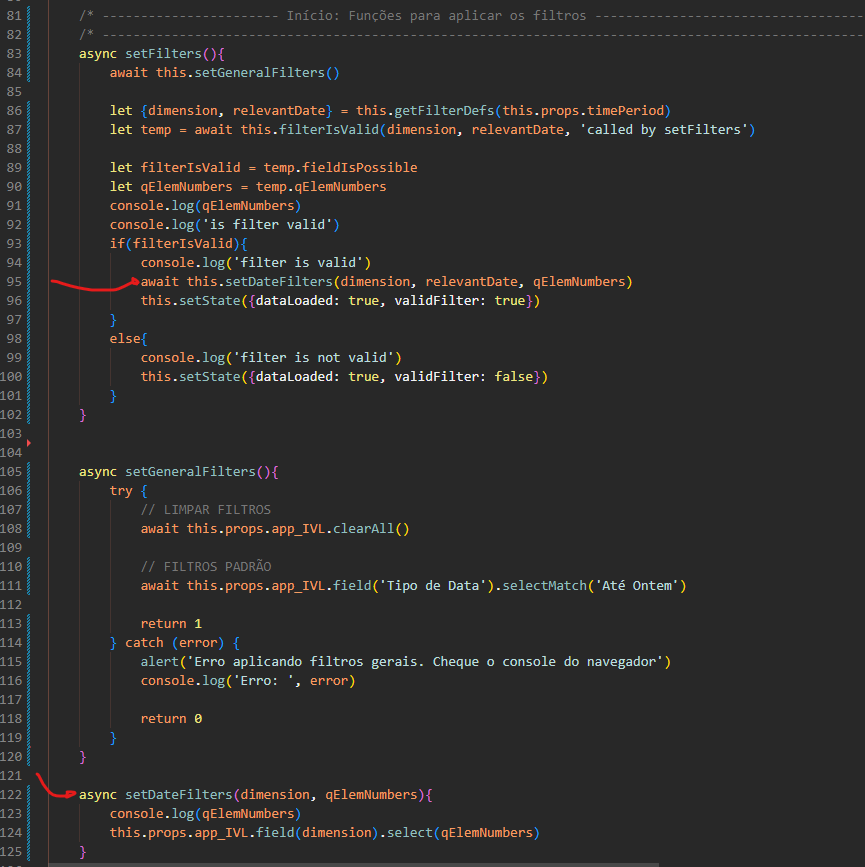

# Funções
## Definição
Funções são trechos de código que podem ser compartimentalizados e reaproveitados, sendo chamados quando necessários.
## Usando funções

Podemos definir funções de 3 maneiras:

1. Declaração de função:

```js
    function minhaFuncao(params){
        // corpo da função
    }
```

2. Expressão de função:

```js
    let minhaFuncao = function(params){
        // corpo da função
    }
```

3. Função de seta:

```js
    let minhaFuncao = (params) => {
        // corpo da função
    }
```

Existem peculiaridades sobre cada tipo de declaração, mas não iremos entrar em detalhes aqui.


Chamamos funções ao digitar o nome delas acrescido do `()` ao final.

Exemplo:

```js
let apresentacao = function(){
    console.log('Olá! Eu sou Pedro')
}

apresentacao()
```
O trecho de código acima define a função `apresentacao` nas 3 primeiras linhas e a chama na última linha.

## Argumentos e Parâmetros
Funções podem receber parâmetros para realizar operações em cima deles. Incrementando nossa função anterior com parâmetros:

```js
let apresentacao = function(nome){
    console.log('Olá! Eu sou ', nome)
}

apresentacao('Pedro')
apresentacao('André')
apresentacao('Antônio')
```

Agora, podemos fazer uma apresentação para qualquer nome utilizando a mesma função. Parâmetros possibilitam que façamos a definição de uma função uma vez e que possamos utilizar ela várias vezes para obter resultados diferentes.


> ## **Encontre o erro!**
>
>


## Valores de Retorno
Funções podem também retornar valores para que as chamou por meio da palavra chave *return*. Observe o exemplo:

```js
let somarNumeros = function(num1, num2){
    let soma = num1 + num2
    return soma
}

let result = somarNumeros(5, 2)
```

Ao chamar a função `somarNumeros` com os parâmetros, a o código começa a execução da função, cria a variavel `soma` que só existe no escopo da função e retorna o valor de `soma` para quem chamou a função. Para que possamos "capturar" o retorno da função, atribuimos a chamada da função à variável `result`, que existe no escopo global.


